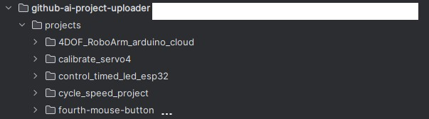

# Arduino Project Publisher

A Python tool that automatically processes Arduino/ESP32 projects, generates meaningful names and documentation using Google's Gemini AI, and uploads them to GitHub repositories.

## Overview

This tool helps manage and publish Arduino/ESP32 projects by:
- Scanning a directory for Arduino projects
- Using Google's Gemini AI to generate appropriate project names
- Creating detailed README.md files for each project
- Creating GitHub repositories with the generated names
- Pushing the code to the newly created repositories

## Features

- Automated project naming using AI
- AI-generated comprehensive documentation
- Automatic GitHub repository creation and code publishing
- Batch processing of multiple Arduino projects

## Requirements

### Dependencies
pip install requests gitpython google-generativeai

### API Keys and Credentials
- GitHub personal access token
- Google Gemini API key

## Setup Instructions

1. Clone this repository
2. Install the required dependencies:
pip install requests gitpython google-generativeai
3. Configure your credentials:
- Replace `GITHUB_USERNAME` and `GITHUB_TOKEN` with your GitHub credentials
- Replace `GENAI_API_KEY` with your Google Gemini API key
4. Organize your Arduino projects in the `projects` folder

## Usage

1. Place your Arduino projects in individual folders inside the `projects` directory
2. Each project folder should contain at least one `.ino` file
3. Run the script:
python main-send.py

The script will:
1. Process each project folder
2. Generate an appropriate project name
3. Create a detailed README.md file
4. Create a GitHub repository with the generated name
5. Push the project files to the new repository

## Project Structure

## Functions

- `sanitize_repo_name(name)`: Cleans up repository names to meet GitHub requirements
- `generate_project_name(arduino_code)`: Uses Gemini AI to generate a descriptive project name
- `generate_readme(project_path, project_name, arduino_code)`: Creates a comprehensive README.md file
- `create_github_repo(project_name)`: Sets up a new GitHub repository
- `push_to_github(project_path, repo_url)`: Pushes the project to GitHub
- `process_projects()`: Main function to process all Arduino projects

## Security Notes

⚠️ **Important**: The current code includes API keys and tokens directly in the script. For security:

1. Move credentials to environment variables or a separate configuration file
2. Add this configuration file to your `.gitignore`
3. Never commit credentials to version control

## Contributing

Feel free to submit issues or pull requests to improve the functionality of this tool.

## License

This project is open source and available under the MIT License.
